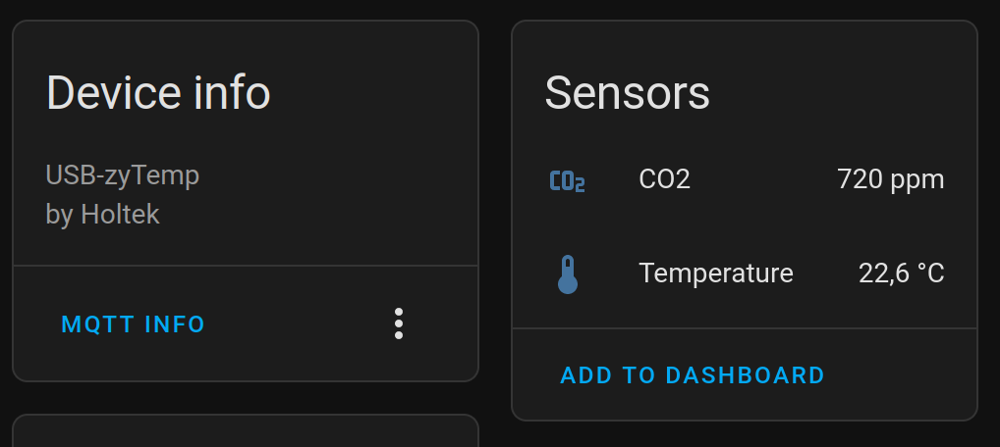

# zytemp-mqtt

This is a MQTT interface for the Holtek USB-zyTemp chipset which is used in inexpensive CO2 monitors, such as [co2Meter.com](http://www.co2meter.com/products/co2mini-co2-indoor-air-quality-monitor) or [TFA Dostmann](https://www.amazon.de/dp/B00TH3OW4Q).

## Installation

* Clone the repository

  ```bash
  git clone https://github.com/patrislav1/zytemp_mqtt.git
  ```

* Install the Python module

  ```bash
  sudo pip3 install .
  ```

* Run the install script to create the service user and the systemd service.

  ```bash
  sudo ./install.sh
  ```

## Configuration

The configuration file can be in `$HOME/.config/zytempmqtt/config.yaml` or `zytempmqtt/config.yaml`.

It contains following configuration:

```yaml
mqtt_host: homeassistant.local  # MQTT server
mqtt_port: 1883                 # MQTT port (default: 1883)
mqtt_username: user             # MQTT username
mqtt_password: pass             # MQTT password
mqtt_client_id: foobar          # MQTT client ID (default: zytemp-mqtt)
mqtt_topic: /foo/bar            # MQTT topic (default: zytemp-mqtt)
friendly_name: aircontrol       # Friendly name for HomeAssistant (default: zytemp-mqtt)
discovery_prefix: homeassistant # Discovery prefix for HomeAssistant (default: homeassistant)
```

## Home Assistant integration

On startup, `zytemp-mqtt` performs [MQTT Discovery](https://www.home-assistant.io/docs/mqtt/discovery/) so that the sensors magically show up in the Home Assistant system without any manual configuration:

 